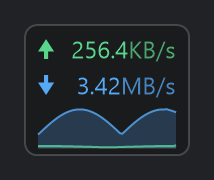
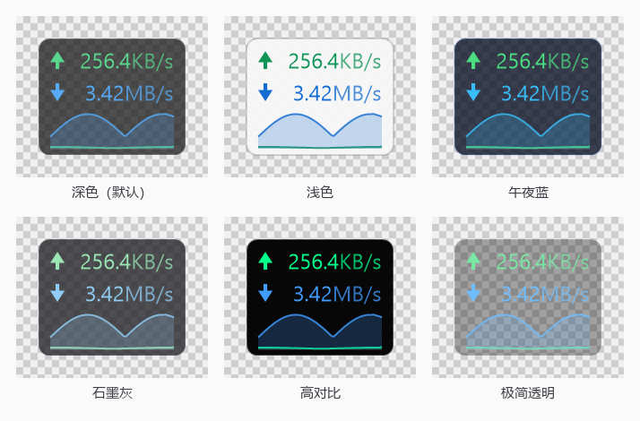

# NetSeep · 轻量级网速悬浮窗

[](https://github.com/wuge2019/NetSeep/actions/workflows/build.yml)
[](LICENSE)
[](#构建)
[](#构建)

一个参考火绒「流量悬浮窗」的 Windows 桌面小工具：一个小巧的半透明浮窗，实时显示当前**上传 / 下载速度**。

- **纯 C# 实现**，只依赖 Windows 自带的 .NET Framework 4.5+，**零第三方组件**
- **单个 exe，约 104 KB**，双击即用，无需安装、不写系统目录
- 分层窗口（`UpdateLayeredWindow`）逐像素 alpha 自绘：圆角、半透明、抗锯齿，与火绒浮窗观感一致
- 逐显示器 DPI 感知（PerMonitorV2），高分屏下依然锐利
- **桌面宠物**：一只跟着网速变状态的小家伙，睡觉 / 发呆 / 踱步 / 小跑 / 冲刺 / 被摸，全部矢量手绘
- 作者：**Lyu** ｜ 许可：[MIT](LICENSE)



---

## 快速开始

从 [Releases](https://github.com/wuge2019/NetSeep/releases) 下载 `NetSeep.exe` 直接双击即可；也可按下方「构建」一节自行编译。

```
dist\NetSeep.exe            # 运行后浮窗出现在屏幕右上角，托盘出现图标
```

> 纯文本速查（命令行 / 菜单 / 卸载 / 杀软误报处置）：[docs/使用说明.txt](docs/使用说明.txt)

| 操作 | 效果 |
| --- | --- |
| 左键拖动 | 移动浮窗（位置自动记住） |
| 右键 | 打开设置菜单 |
| 双击 | 锁定 / 解锁位置 |
| 滚轮 | 调整不透明度 |
| `Ctrl + Alt + N` | 开关「鼠标穿透」（浮窗不再拦截点击） |
| 托盘图标双击 | 把浮窗拉回默认位置并恢复交互 |
| **点一下宠物** | 摸摸它（冒爱心、脸红、开心 2 秒），菜单里能看到被摸次数 |
| **拖动宠物** | 给它搬家（位置自动记住） |

> 鼠标穿透开启后浮窗收不到鼠标消息，**用 `Ctrl+Alt+N` 或托盘菜单恢复**。

## 功能

- **实时速率**：`↑ 上传` / `↓ 下载`，单位自动在 `B/s → KB/s → MB/s → GB/s` 间切换，数字右对齐，宽度不跳动
- **主题切换**：7 套内置主题（深色 / 浅色 / 午夜蓝 / 石墨灰 / 高对比 / 极简透明）+ **跟随系统**（随 Windows 浅色深色模式自动变色）+ 自定义配色，右键菜单一键切换
- **桌面宠物**：状态跟着网速走，可以摸、可以拖、可以调大小、可以关掉；全屏时自动让位
- **合计或指定网卡**：默认统计所有真实网卡；也可在菜单里只盯某一块网卡（自动排除回环、隧道与 NDIS 过滤层，不会把同一份流量重复计算）
- **迷你曲线图**：最近 60 秒的上下行走势
- **刷新间隔**：0.5 / 1 / 2 / 5 秒
- **不透明度**：100% ~ 50%，滚轮快捷调整（与主题叠加生效）
- **置顶显示 / 锁定位置 / 鼠标穿透 / 全屏时自动隐藏**（全屏游戏、视频时自动让位）
- **开机自动启动**：写入 `HKCU\...\CurrentVersion\Run`，不需要管理员权限
- **托盘常驻**：即使浮窗被隐藏或穿透，也能从托盘菜单找回
- **便携模式**：exe 同目录放一个 `portable.txt`，配置改存到 `NetSeepData\` 子目录，不碰 `%APPDATA%`
- **单实例**：重复启动不会出现第二个托盘图标
- 崩溃时把异常写到 `%APPDATA%\NetSeep\error.log`，不会静默消失

## 主题

右键菜单 → **主题** 即可切换；选择「跟随系统」时，Windows 在浅色 / 深色之间切换会立刻反映到浮窗上。



主题只影响配色，和「不透明度」是两个独立维度：例如「极简透明」+ 60% 不透明度可以把浮窗压到几乎只剩数字。

## 桌面宠物

一只自己画出来的小家伙，**状态完全跟着当前网速走**：


| 状态 | 触发条件 | 表现 |
| --- | --- | --- |
| 睡觉 | 完全没有流量 | 身体变灰、闭眼、头顶冒 `z` |
| 发呆 | < 16 KB/s | 睁眼、瞳孔跟着鼠标转、随机眨眼、在自己窝附近溜达 |
| 踱步 | 16 ~ 160 KB/s | 迈开小碎步、尾巴摆动加快 |
| 小跑 | 160 KB/s ~ 1.5 MB/s | 张嘴笑、身后拖出速度线、天线变成琥珀色 |
| 冲刺 | > 1.5 MB/s | 星星眼、脸红、天线通红发光、速度线更密 |
| 被摸 | 点它一下 | `^ ^` 眯眼笑 + 脸红 + 冒爱心，开心 2 秒后回到按网速判断的状态 |

- **天线上的光球就是速度指示灯**：暗灰（睡着）→ 主题色（正常）→ 琥珀（小跑）→ 通红并脉动（冲刺）
- 右键宠物 = 弹出和浮窗一样的菜单，里有「桌面宠物」子菜单：显示/隐藏、大小 75%~200%、摸摸它、让它回到原位
- 宠物和浮窗是**两个独立窗口**：可以分别拖动、分别记忆位置；浮窗设了「置顶」宠物也跟着置顶
- **全屏游戏/电影时宠物会自动隐藏**（和浮窗一样判断），退出全屏自动回来
- 它只在自己窝附近 ±34 像素溜达，不会满屏乱跑；拖到哪儿，哪儿就是新窝

## 命令行

```
NetSeep.exe                     启动悬浮窗
NetSeep.exe --silent            启动但不弹首次运行提示（供开机自启使用）
NetSeep.exe --dump [秒]         控制台实测网速，并打印网卡列表与采样行布局
NetSeep.exe --list              列出所有网卡
NetSeep.exe --preview 路径 [缩放] [主题]  渲染界面预览图（透明/深色/浅色/棋盘格四张）
NetSeep.exe --themes 目录 [缩放]          每个内置主题各出一张预览图（用于做主题画廊）
NetSeep.exe --pet 路径 [缩放]             把宠物 6 种状态画成一排（用于做 README 插图）
NetSeep.exe --reset             删除配置文件
NetSeep.exe --help              帮助
```

主题 id：`dark` / `light` / `midnight` / `graphite` / `contrast` / `glass` / `system` / `custom`，
例如 `NetSeep.exe --preview out.png 2 light`。

`--dump` 很适合排错，例如：

```
> NetSeep.exe --dump 5
  行布局：1352 (UCHAR[32])（命中 26/32；候选 1352 (UCHAR[32])=26/32; 1448 (ULONG[32])=0/32;）
  [已连接] WLAN 3  (Wifi6 802.11ax USB Adapter)
  ...
  时间      下载速率        上传速率
        1s        1.13MB/s         12KB/s
```

## 构建

无需 Visual Studio / .NET SDK，只要 Windows 自带的 .NET Framework 编译器：

```powershell
.\build.ps1                                   # 输出 dist\NetSeep.exe，并打印 SHA256 与签名状态
.\build.ps1 -StopRunning                      # 覆盖前自动结束正在运行的实例
.\build.ps1 -Run                              # 编译完直接运行
.\build.ps1 -Preview                          # 顺便生成预览图
.\build.ps1 -Minimal                          # 精简版 NetSeep-minimal.exe（排查杀软误动用）
.\build.ps1 -Pfx 证书.pfx -PfxPassword 密码    # 编译并用代码签名证书做 Authenticode 签名
```

- 编译器：`%WINDIR%\Microsoft.NET\Framework64\v4.0.30319\csc.exe`（Win7 及以上自带）
- 若检测到 Windows SDK 的 `rc.exe`，会额外写入**图标 + 应用程序清单 + 完整版本信息**（见下文「杀软误报」）
- 图标由 `tools\make_icon.py` 生成（需要 Python + Pillow，仅在改动图标时才用得到）
- `-Minimal` 会用 `/define:MINIMAL_BUILD` 编译掉**注册表自启、全局热键、鼠标穿透、控制台输出**，其余功能不变；用来判断杀软到底是"行为型"还是"文件型"误报

## 配置文件

`%APPDATA%\NetSeep\config.ini`（便携模式为 `exe目录\NetSeepData\config.ini`），纯文本 `键=值`，删掉即恢复默认：

```ini
nic=                      # 网卡 GUID，空 = 全部网卡合计
showup=1  showdown=1      # 显示上传 / 下载
showgraph=0               # 迷你曲线图
intervalms=1000           # 刷新间隔
theme=dark                # 主题：dark/light/midnight/graphite/contrast/glass/system/custom
opacity=88                # 不透明度 %
topmost=1  locked=0       # 置顶 / 锁定位置
clickthrough=0            # 鼠标穿透
autohidefullscreen=1      # 全屏时自动隐藏
x=1756  y=690             # 浮窗位置
# 桌面宠物
pet=1                     # 是否显示宠物
petsize=100               # 宠物大小百分比（50~300）
petx=1808  pety=968       # 宠物位置（拖到哪儿存哪儿）
# 以下四项仅在 theme=custom 时生效
bgalpha=190               # 底板透明度
upcolor=90,214,140        # 上行颜色 R,G,B
downcolor=86,170,245      # 下行颜色
bgcolor=24,24,27          # 底板颜色
```

## 杀软误报处理（实测结论）

### 为什么会被报

小体积、**没有数字签名**、带 P/Invoke、还没有任何云端信誉的 .NET 程序，是杀软云查杀/启发式引擎的重点关照对象——**每重新编译一次就是一个全新哈希，等于一个"从没见过的可疑文件"**。

在开发机上实测到的事实（Windows 11 + 360安全卫士 + 火绒 + Defender 三套引擎）：

| 引擎 | 实测记录 | 结论 |
| --- | --- | --- |
| **360安全卫士** | `360Safe\deepscan\uploadlog.dat` 记录了 NetSeep.exe 被**云查杀自动上传分析 5 次**（21:57:55 / 21:59:30 / 22:07:56 / 22:10:34 / 22:21:51，正好对应 5 次编译）；`PopWndTrackerLog` 把浮窗登记为 popup（`lev=0`，21 次）；`木马查杀` 快速扫描报告里 NetSeep **未**被列为威胁，但把一个临时调试 exe 加进了白名单 | **误报来源就是它**：新编译的无签名 exe 一律送云端 AI 判定，弹出"发现未知/风险文件" |
| 火绒 | 隔离区 `QuarantineEx.db`、日志 `log.db`、HIPS `hips.db`、弹窗拦截 `popblkuser.db` **全部没有 NetSeep 记录**（只有联网统计表中出现过进程路径） | 火绒没有拦过它 |
| Windows Defender | 实时防护处于关闭状态，`Get-MpThreatDetection` 无记录 | 未参与 |

也就是说：**这不是代码里有恶意行为，而是"新编译 + 无签名 + 无信誉"导致的云端启发式误报**，换任何杀软、任何小工具都会遇到同样的问题。

### 项目已经做的缓解

1. exe 内含完整**版本信息**（产品名 / 公司 / 版本 / 描述 / 版权）+ 程序图标 + 应用程序清单 + `TargetFramework` 元数据——这些是启发式/机器学习打分的重要项，缺失会被扣分；
2. **默认行为面尽量小**：启动时不注册全局热键（只在开启"鼠标穿透"期间注册，作为逃生键）、不创建控制台窗口、不探测前台窗口（全屏判断改用系统的 `SHQueryUserNotificationState`）、不写注册表（自启是可选菜单项，只在你主动勾选时写一次）；
3. 不联网、不注入、不读其他进程内存、不释放任何文件，只调用 `GetIfTable2` 读取系统网卡收发字节数；
4. 提供便携模式（放一个 `portable.txt`），连 `%APPDATA%` 都不碰；
5. 构建脚本输出 `dist\NetSeep.exe.sha256`，可自行校验、送检比对。

### 怎么办（按见效速度排序）

**① 立刻可用：加入信任/排除**

- **360安全卫士**（本例的误报来源）
  - `木马查杀 → 信任区 → 添加文件/目录` → 选中 `dist\NetSeep.exe` 或整个 `dist` 目录；
  - `设置 → 白名单` 里同样加一条；
  - 若弹出"发现未知文件/风险程序"，选择**允许/信任**，不要选择"清除"，否则文件会被直接删掉（实测发生过：一次编译产物在 360 云查杀期间被移除，且恢复区里没有副本）。
- **火绒**：`防护中心 → 信任区 → 添加文件/目录`。
- **Defender**（管理员 PowerShell）：`Add-MpPreference -ExclusionPath "F:\WodeCode\NetSeep\dist"`。
- 从压缩包解压出来的文件带"来自 Internet"标记，更容易被拦：右键 exe → 属性 → 勾选"解除锁定"，或 `Unblock-File .\NetSeep.exe`。

**② 上报误报（通常 1~2 个工作日解除，按文件哈希加白）**

- 360：<https://fuwu.360.cn/shensu>（开发者/站长申诉）
- 火绒：火绒官方论坛「误报反馈」版块，或客户端「上报样本」
- 微软：<https://www.microsoft.com/wdsi/filesubmission>

上报时可附 `dist\NetSeep.exe.sha256` 与源码，说明：

> NetSeep 是开源的 Windows 网速悬浮窗小工具，纯 C#（.NET Framework）编写，不联网、不注入、不释放文件、不修改系统设置，仅调用 `GetIfTable2` 读取系统网卡收发字节数用于显示实时速率，源码可提供审计。

**③ 彻底根治：数字签名**

买一张代码签名证书（OV/EV），然后：

```powershell
.\build.ps1 -Pfx 你的证书.pfx -PfxPassword 密码
```

签名后 SmartScreen 与绝大多数杀软的"未知程序"判定都会消失，这是唯一能从根本上解决问题的办法。（`signtool.exe` 由 Windows SDK 提供，脚本会自动查找。）

**④ 定位是"行为型"还是"文件型"误报**

```powershell
.\build.ps1 -Minimal
```

- 精简版不报、完整版报 → 是行为特征（自启/热键/穿透/控制台）引起的，可在菜单里关掉对应项；
- 两个都报 → 是文件信誉/签名问题，只能走 ①②③。

**⑤ 一条容易忽略的建议**

本机同时装了 360 + 火绒 + Defender 三套引擎，未知文件被"抢答"的概率会成倍上升。如果不是刻意为之，建议只保留一套实时防护。

### 自检脚本

```powershell
powershell -ExecutionPolicy Bypass -File tools\check-false-positive.ps1
```

会打印：文件大小/SHA256/版本信息是否齐全、**是否已签名**、是否带"来自 Internet"标记（可加 `-Unblock` 一键解除）、本机装了哪些安全软件、以及上面 ①~④ 的完整处置步骤和送检说明。


## 实现要点

| 主题 | 做法 |
| --- | --- |
| 取流量 | `iphlpapi!GetIfTable2` 的 64 位收发计数器差分（跨 1 秒采样，用 `Stopwatch` 计实际间隔） |
| 行布局差异 | `MIB_IF_ROW2` 在不同系统里可能是 1352 或 1448 字节（`PermanentPhysicalAddress` 为 `UCHAR[32]` 或 `ULONG[32]`）。程序**启动时自动探测**：用 `NET_LUID` 位域（低 24 位保留 0、中 24 位索引、高 16 位网卡类型）+ MTU/类型/状态合理性给候选布局打分，选命中最高的那份，然后按偏移直接读内存，不套结构体 |
| 去重 | 用 `InterfaceAndOperStatusFlags` 的 `FilterInterface` 位剔除 WFP/QoS/安全软件的 NDIS 过滤层（它们与物理网卡计数完全相同），避免合计翻几倍 |
| 悬浮窗 | `WS_EX_LAYERED + WS_EX_TOOLWINDOW + WS_EX_NOACTIVATE`，`UpdateLayeredWindow` + 32bpp 预乘 alpha DIB 逐像素自绘（GDI+ 直接绘制在 DIB 上，无二次拷贝） |
| 箭头 | 矢量绘制（三角 + 短杆），任意 DPI 下都清晰 |
| DPI | 清单声明 `PerMonitorV2`，`GetDpiForWindow` 取当前显示器缩放，`WM_DPICHANGED` 时重新排版 |
| 全屏检测 | 前台窗口矩形是否覆盖其所在显示器整屏，且**没有标题栏**（`WS_CAPTION`）——最大化窗口不会被误判 |
| 托盘 | 代码绘制图标（不依赖外部 ico 文件），`NotifyIcon` 与浮窗共用同一份深色菜单 |

## 目录结构

```
src\
  Program.cs       入口、命令行工具（--dump / --preview / --themes / --pet / --list）、控制台输出封装
  WidgetForm.cs    浮窗窗体、交互、托盘、右键菜单、宠物的生成与联动
  Render.cs        自绘渲染（圆角底板、箭头、数值、迷你曲线）、深色菜单渲染器、图标绘制
  Pet.cs           桌面宠物：状态机 + 全部矢量绘制
  Surface.cs       逐像素 alpha 的分层绘制表面（浮窗与宠物共用）
  Theme.cs         主题预设与解析（含“跟随系统”深浅色检测）
  Traffic.cs       网卡枚举、行布局探测、差分测速、速率格式化
  Config.cs        配置持久化、开机自启（精简构建下会被编译掉）、颜色解析
  Native.cs        Win32 P/Invoke（只声明真正用到的接口）
  app.manifest     DPI 感知 / 兼容性 / asInvoker
  app.rc           图标 + 清单 + 版本信息（由 build.ps1 用 rc.exe 编译）
  AssemblyInfo.cs  程序集元数据（含 TargetFramework，降低启发式误报）
assets\            图标、界面预览图、主题画廊
tools\
  make_icon.py              生成图标（可选，需要 Python + Pillow）
  make_theme_gallery.py     把 --themes 的输出拼成主题画廊图（可选）
  check-false-positive.ps1  误报自检与处置助手
build.ps1          一键构建（-Minimal 精简版 / -Pfx 签名）
dist\
  NetSeep.exe         正式产物
  NetSeep.exe.sha256  校验值
  NetSeep-minimal.exe 精简版（-Minimal 生成，用于排查误报）
```

## 常见问题

- **浮窗不见了？** 可能被全屏程序自动隐藏，或开了鼠标穿透：双击托盘图标即可拉回；也可看托盘菜单里的「显示浮窗」。
- **数字一直是 0？** 在菜单「选择网卡」里确认选中了当前在用的网卡（默认「全部网卡（合计）」）；或用 `NetSeep.exe --dump 5` 看实际采样值。
- **合计速度偏大？** 若有 VPN/虚拟网卡同时在线，合计会包含它们，建议在菜单里选定具体的物理网卡。
- **需要管理员权限吗？** 不需要，程序以当前用户权限运行（`asInvoker`）。
- **命令行没有输出？** 它是窗口程序，只"附着"到调用它的控制台；从资源管理器双击运行时结果会写到 `%APPDATA%\NetSeep\last-output.txt` 并弹窗提示路径。
- **鼠标穿透开了怎么恢复？** 按 `Ctrl+Alt+N`，或右键托盘图标 → 取消「鼠标穿透」。热键只在穿透开启期间注册，平时不占用。
- **被 360/火绒 拦了？** 见上文「杀软误报处理」，或直接跑 `tools\check-false-positive.ps1`。

## 作者与许可

- 作者：**Lyu**
- 许可：[MIT License](LICENSE)，Copyright (c) 2026 Lyu
- 欢迎 Issue / PR；若是杀软误报，请附上 `tools\check-false-positive.ps1` 的输出（含 SHA256）。

